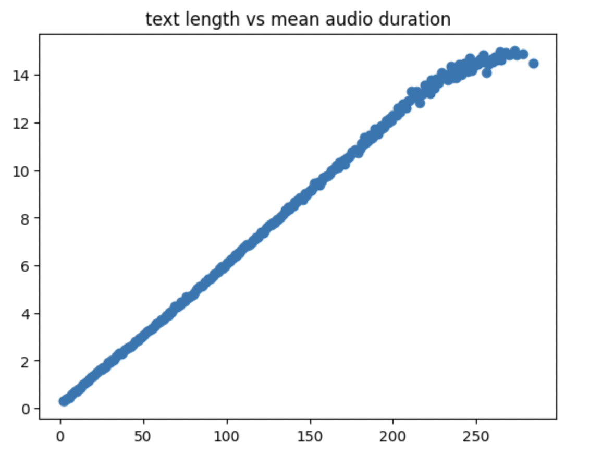
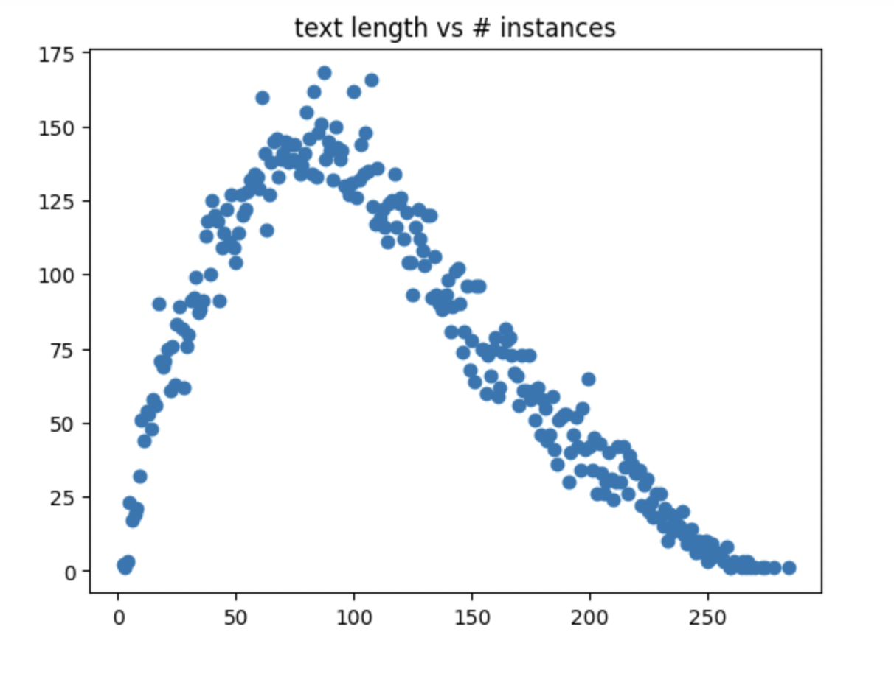
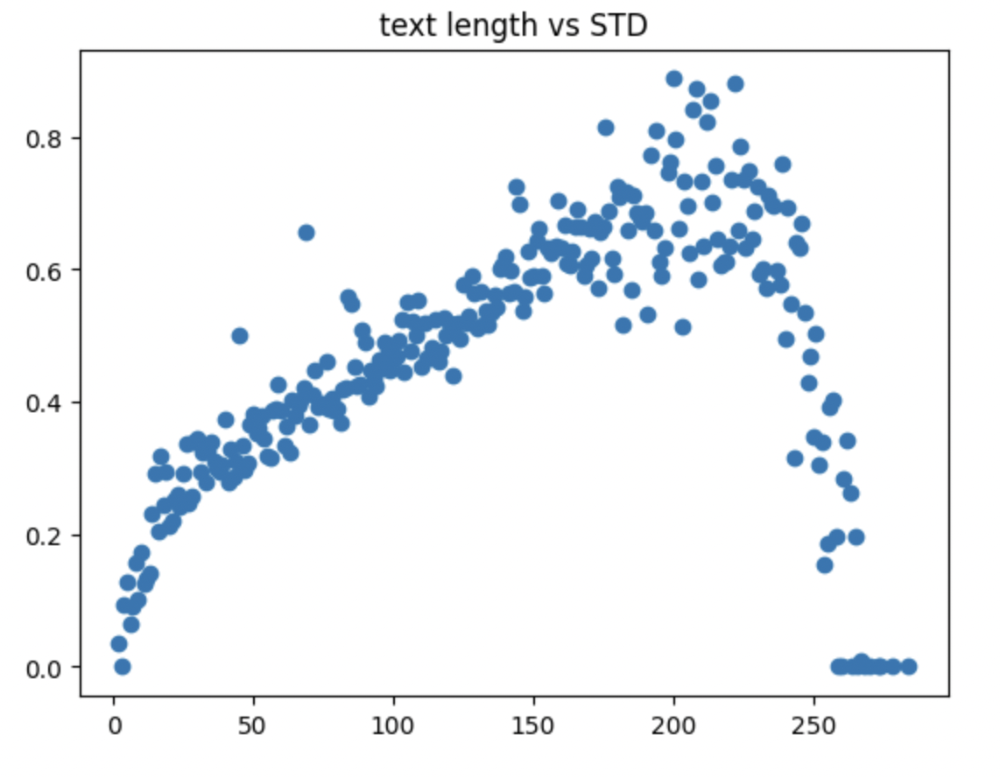

# Bulgarian Text-to-Speech

I have trained a Bulgarian Text-to-Speech (TTS) model using the Variational Inference ([VITS](https://arxiv.org/pdf/2106.06103.pdf)) architecture. This project purpose is to generate high-quality synthetic speech from input text in the Bulgarian language. For legal reasons, I cannot share the dataset because i don't own the collected data. Hopefully in the future I'll release the trained model.

## Dataset
I collected a custom dataset which consists of 18,973 22kHz WAV audio samples of a single speaker with a total length of approximately 17 hours and 30 minutes. The audio format is 16-bit PCM with a sample rate of 22kHz. 

### Average Seconds vs Character Lengths

Having a linear pattern for time vs. character lengths is vital to ensure a consistent speech rate during audio generation.

### Number of Samples vs Character Lengths

For a normal speech rate it's important for this plot to have a smooth distribution.

### Standard Deviation vs Character Lengths

The standard deviation should stay in a range no larger than 0.8. Having a low standard deviation is vital to ensure a consistent speech rate during audio generation. In my case the distribution of STD turned out a bit uneven.

## Model
I utilized the VITS model architecture from the [CoquiTTS](https://github.com/coqui-ai/TTS) library, which is built on top of the PyTorch framework.

## Results
Through this project, I successfully trained a Bulgarian TTS model with a custom dataset capable of converting text input into a synthetic speech. The model demonstrates reasonable speech synthesis performance. 

You can hear samples in my [website](https://stmv.me/projects).

In the future, i plan to release the model and add multiple speakers and languages.
